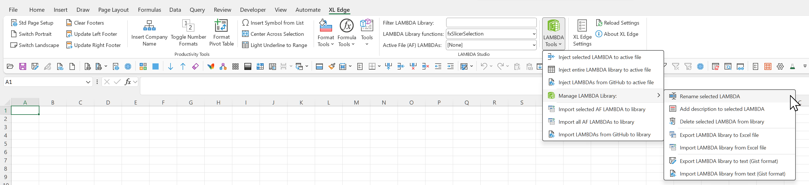

# XL Edge

An Excel add-in that puts a **library of custom LAMBDA functions in the ribbon** —
stored, searchable, described, and shareable — alongside a deep set of
productivity macros built up over years of finance and reporting work.

Free to use and free to modify. MIT licensed. No sign-up, no trial, no telemetry.

> ### Requirements, up front
>
> Windows Excel with macro (VBA) support — desktop Excel 2016 or later, or a
> Microsoft 365 build. LAMBDA authoring itself needs a version of Excel that has
> `LAMBDA` (Microsoft 365 / Excel 2021+). This is a `.xlam` add-in; there is no
> Mac or web build.

---

## Install

1. **Download** the latest `XL Edge.xlam` from the
   [Releases](https://github.com/wfphillips128/xl-edge-excel-addin/releases) page
   (or clone this repo — the current build sits at the root).
2. **Unblock it.** Excel blocks macros in any file downloaded from the internet.
   Right-click `XL Edge.xlam` → **Properties** → tick **Unblock** → **OK**.
   *Without this step the ribbon tab will not appear.* This is Windows security
   policy, not a fault in the add-in.
3. **Load it.** Either double-click the file, or add it permanently through
   **File → Options → Add-ins → Manage: Excel Add-ins → Go → Browse**.
4. An **XL Edge** tab appears in the ribbon.

---

## What it does

### LAMBDA Studio — the headline

Custom LAMBDA functions are powerful and almost impossible to manage. They live
in Name Manager, one workbook at a time, with a text box for a formula and
nowhere to record what the thing actually does. Moving one between workbooks
means copying strings by hand.

LAMBDA Studio replaces that with a real library:

- **Filter box + dropdowns** — search the stored library, and see the LAMBDAs
  already defined in the active file, side by side.
- **Inject** a selected LAMBDA, or the entire library, into the active workbook —
  or pull LAMBDAs straight **from a GitHub gist**.
- **Manage the library** — rename, add a description, delete.
- **Import / export in two formats** — an **Excel workbook** for handing to a
  colleague, and the **Advanced Formula Environment gist text** format for
  anyone publishing to GitHub.
- **Round-trip with the active file** — import a LAMBDA (or all of them) from the
  workbook you're in back into the library.

Under the hood every operation is normalised to a single shape —
`(name, formula, description)` — so each menu item is just a *source* paired with
a *sink*. Adding a new source later (a different site, a database) is one
function, not a new menu.

### Productivity Tools

Macros refactored to modern VBA standards for speed and reliability, grouped on
the ribbon:

- **Page setup & footers** — standard page setup, portrait/landscape switches,
  confidentiality-footer management, insert company name.
- **Format Tools** — number-scale and date-format toggles, financial-formatting
  presets, font/colour/fill toggles, indent handling, remove empty rows &
  columns, strip special formatting, set row heights / column widths across a
  selection or the whole sheet, and more.
- **Formula Tools** — fill right/down, wrap with `ROUND` / `IFERROR` /
  parentheses / sign-flip, convert to absolute or relative references, change
  `SUM` to `SUBTOTAL`, list a formula as text, trim/prefix/suffix text, scale a
  range by 1000 or by a selected value, change case, and more.
- **Tools** — speak cell contents, toggle gridlines, unmerge & center across,
  copy sheets to a new file without formulas, remove formulas from a
  selection / sheet / workbook, shrink the file, and quick jumps to the VBA
  editor, macro dialog and add-in location.

### Settings & About

A settings form and an About dialog. Constants (footer text, default row
heights and column widths, formula-bar sizes) live in the settings store, so the
defaults are yours to change without touching code.

---

## Source

All 13 VBA modules are exported to [`src/`](src/) so the code is browsable
without opening Excel. The ribbon definition is in
[`customUI/customUI14.xml`](customUI/customUI14.xml).

The **`.xlam` is the authoritative, runnable artifact** — the exported `.frm`
files carry the form code-behind for reading, not the form layout, so `src/` is
for review rather than a clean re-import. To work on the code, open the `.xlam`
in Excel and use the VBA editor (Alt+F11).

The macros were recently refactored by Claude Code using the author's
`excel-macro-optimizer` skill, to apply modern coding standards for speed,
reliability and maintainability.

---

## Licence

MIT — see [LICENSE](LICENSE). Free to use, free to modify, no attribution
required.
