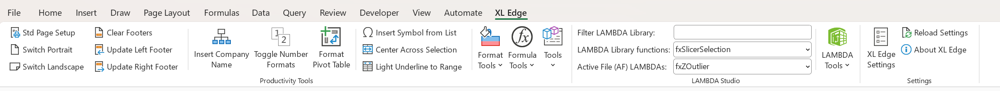
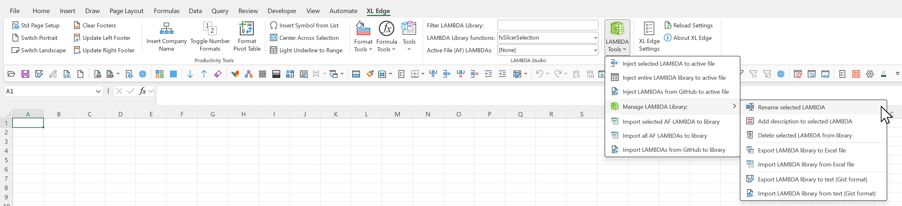
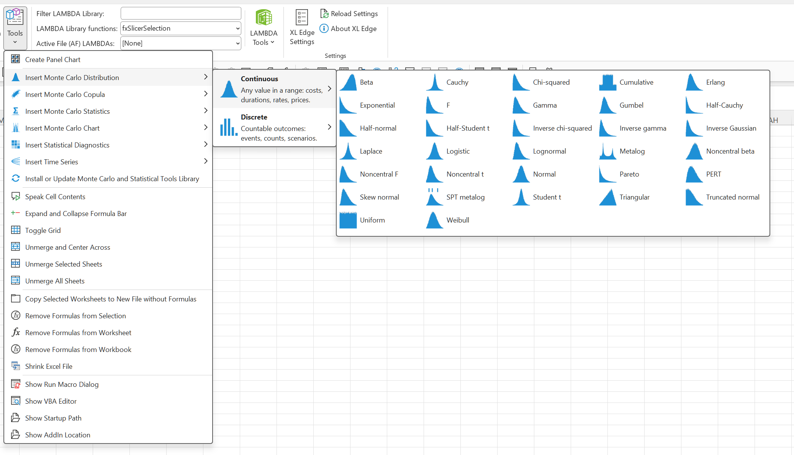
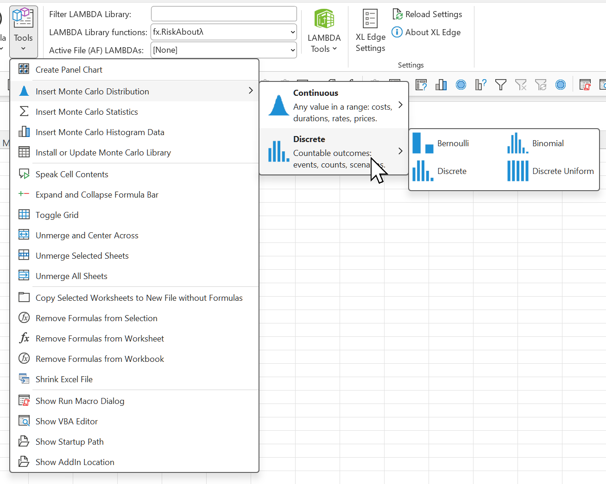
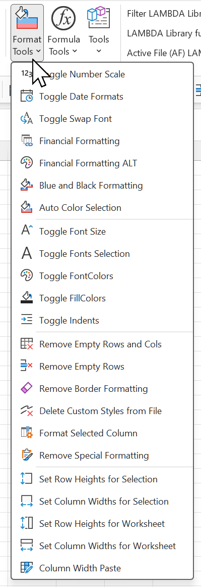
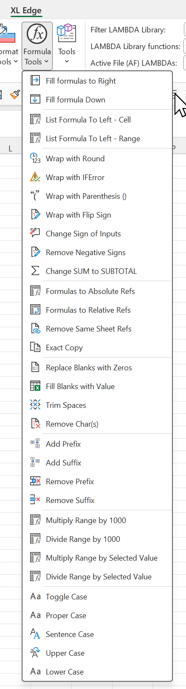
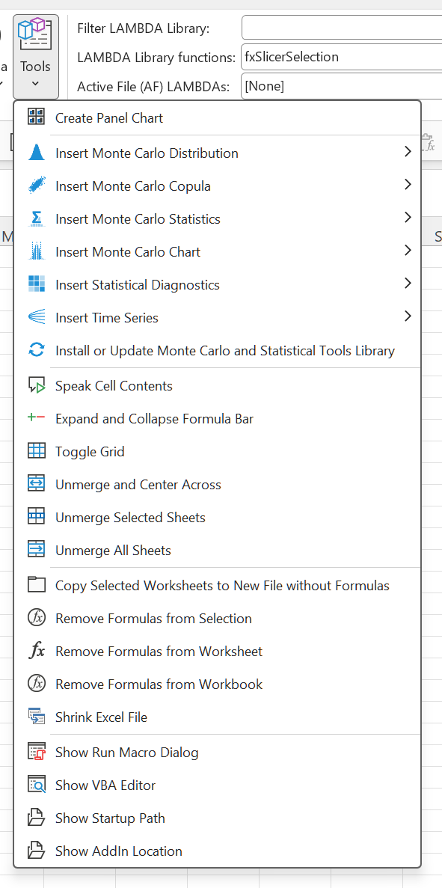

# XL Edge

An Excel add-in that puts a **library of custom LAMBDA functions in the ribbon** —
stored, searchable, described, and shareable — alongside a deep set of
productivity macros built up over years of finance and reporting work.

Free to use and free to modify. MIT licensed. No sign-up, no trial, no telemetry.

> ### Requirements, up front
>
> Windows Excel with macro (VBA) support — desktop Excel 2016 or later, or a
> Microsoft 365 build. LAMBDA authoring itself needs a version of Excel that has
> `LAMBDA` (Microsoft 365 / Excel 2021+). This is a `.xlam` add-in; there is no
> Mac or web build.

**Overview in PDF:** an 8-page [brochure](docs/XL-Edge-brochure.pdf) (US Letter,
for printing or email) and a 13-page [carousel](docs/XL-Edge-carousel.pdf)
(the LinkedIn version).

---

## Install

1. **Download** the latest `XL Edge.xlam` from the
   [Releases](https://github.com/wfphillips128/xl-edge-excel-addin/releases) page
   (or clone this repo — the current build sits at the root).
2. **Unblock it.** Excel blocks macros in any file downloaded from the internet.
   Right-click `XL Edge.xlam` → **Properties** → tick **Unblock** → **OK**.
   *Without this step the ribbon tab will not appear.* This is Windows security
   policy, not a fault in the add-in.
3. **Load it.** Either double-click the file, or add it permanently through
   **File → Options → Add-ins → Manage: Excel Add-ins → Go → Browse**.
4. An **XL Edge** tab appears in the ribbon.

---

## What it does

### LAMBDA Studio — the headline

Custom LAMBDA functions are powerful and almost impossible to manage. They live
in Name Manager, one workbook at a time, with a text box for a formula and
nowhere to record what the thing actually does. Moving one between workbooks
means copying strings by hand.

LAMBDA Studio replaces that with a real library:

- **Filter box + dropdowns** — search the stored library, and see the LAMBDAs
  already defined in the active file, side by side.
- **Inject** a selected LAMBDA, or the entire library, into the active workbook —
  or pull LAMBDAs straight **from a GitHub gist**.
- **Manage the library** — rename, add a description, delete.
- **Import / export in two formats** — an **Excel workbook** for handing to a
  colleague, and the **Advanced Formula Environment gist text** format for
  anyone publishing to GitHub.
- **Round-trip with the active file** — import a LAMBDA (or all of them) from the
  workbook you're in back into the library.

Under the hood every operation is normalised to a single shape —
`(name, formula, description)` — so each menu item is just a *source* paired with
a *sink*. Adding a new source later (a different site, a database) is one
function, not a new menu.

### Panel Charts

**Tools → Create Panel Chart** builds a grid of small charts — one chart per
region, product or partner, all sharing a single scale — as **one native chart
object**, not R × C copies whose axes drift apart the moment the data changes.

Select a block of data first to build from it, or run it with nothing selected
to get a placeholder block to paste your own numbers over. It lands on its own
new sheet, with print setup already fixed to one landscape page.

The whole grid runs two coordinate systems through one plot area: the primary
axes carry the data, with every panel's periods laid end to end; the secondary
axes carry the furniture — dividers, band rules, baselines, panel titles and
the tick labels that stand in for the hidden value axis. Every band is a
miniature copy of the same scale, which is what makes the panels comparable.

Line and bar orientations, and a self-check (`PanelSelfCheck`) that exercises
the geometry with every workbook closed.

### Monte Carlo Distributions

Five items on the **Tools** menu, directly under Create Panel Chart, put Monte
Carlo simulation into a workbook as **native LAMBDA formulas** — modern
versions of the distribution functions in tools such as XLRisk and @RISK.

> **New in 2.1:** 24 more distributions (39 in all) and **Insert Monte Carlo
> Risk Measures** for Value at Risk, Conditional Value at Risk and Expected
> Shortfall. The library behind them is now v0.3.0.

- **Insert Monte Carlo Distribution** — pick from 39 distributions, each with a
  small picture of its shape:
  - *Continuous (30):* Beta, Cauchy, Chi-squared, Cumulative, Erlang,
    Exponential, F, Gamma, Gumbel, Half-Cauchy, Half-normal, Half-Student t,
    Inverse chi-squared, Inverse gamma, Inverse Gaussian, Laplace, Logistic,
    Lognormal, Noncentral beta, Noncentral F, Noncentral t, Normal, Pareto,
    PERT, Skew normal, Student t, Triangular, Truncated normal, Uniform, Weibull
  - *Discrete (9):* Benford, Bernoulli, Binomial, Discrete, Discrete Uniform,
    Geometric, Hypergeometric, Negative Binomial, Poisson

  

  It prompts for each parameter and writes an ordinary formula such as
  `=fx.RiskPertλ($C$4, $C$5, $C$6, MC_Trials, 7)`. The trial count lives in one
  workbook name (`MC_Trials`), and every input gets its own stream id so the
  inputs stay independent. Optional parameters (a beta's bounds, a truncated
  normal's limits) can be left out by typing `none`.
- **Insert Monte Carlo Statistics** — a labelled block of trials, mean,
  standard deviation, min, max and percentiles for a spilled result.
- **Insert Monte Carlo Histogram Data** — bin centres and counts, ready to chart.
- **Insert Monte Carlo Risk Measures** — a labelled block of **VaR**, **CVaR**
  and **Expected Shortfall** for a spilled result, at a confidence level you
  choose. Trials are read as P&L unless you say they are losses; either way the
  loss is reported as a positive number.
- **Install or Update Monte Carlo Library** — pulls the functions from the
  public [gist](https://gist.github.com/wfphillips128/f91bff77212ab2c3d8f55a4f0a51b8b6)
  into the active workbook. Needs an internet connection.

Each distribution is a **non-volatile dynamic array**: one cell spills every
trial, and the trials do not reshuffle when something unrelated recalculates,
because the randomness is keyed to a seed rather than to `RAND`. The add-in only
*writes* the formulas — the functions themselves are defined names inside the
workbook — so a finished model keeps calculating for people who have never
installed XL Edge.

The full function reference, conventions and attribution are on the
[project page](https://edgewisedata.com/projects/monte-carlo-lambdas).

### Productivity Tools

Macros refactored to modern VBA standards for speed and reliability, grouped on
the ribbon:

- **Page setup & footers** — standard page setup, portrait/landscape switches,
  confidentiality-footer management, insert company name.
- **Format Tools** — number-scale and date-format toggles, financial-formatting
  presets, font/colour/fill toggles, indent handling, remove empty rows &
  columns, strip special formatting, set row heights / column widths across a
  selection or the whole sheet, and more.
- **Formula Tools** — fill right/down, wrap with `ROUND` / `IFERROR` /
  parentheses / sign-flip, convert to absolute or relative references, change
  `SUM` to `SUBTOTAL`, list a formula as text, trim/prefix/suffix text, scale a
  range by 1000 or by a selected value, change case, and more.
- **Tools** — **create a panel chart** and the five **Monte Carlo** items (above),
  speak cell contents, toggle
  gridlines, unmerge & center across,
  copy sheets to a new file without formulas, remove formulas from a
  selection / sheet / workbook, shrink the file, and quick jumps to the VBA
  editor, macro dialog and add-in location.

<table>
<tr>
<td width="33%" valign="top"></td>
<td width="33%" valign="top"></td>
<td width="33%" valign="top"></td>
</tr>
<tr>
<td align="center"><em>Format Tools</em></td>
<td align="center"><em>Formula Tools</em></td>
<td align="center"><em>Tools</em></td>
</tr>
</table>

### Settings & About

A settings form and an About dialog. Constants (footer text, default row
heights and column widths, formula-bar sizes) live in the settings store, so the
defaults are yours to change without touching code.

---

## Source

All 21 VBA modules are exported to [`src/`](src/) so the code is browsable
without opening Excel. The ribbon definition is in
[`customUI/customUI14.xml`](customUI/customUI14.xml).

The **`.xlam` is the authoritative, runnable artifact** — the exported `.frm`
files carry the form code-behind for reading, not the form layout, so `src/` is
for review rather than a clean re-import. To work on the code, open the `.xlam`
in Excel and use the VBA editor (Alt+F11).

The macros were recently refactored by Claude Code using the author's
`excel-macro-optimizer` skill, to apply modern coding standards for speed,
reliability and maintainability.

---

## Licence

MIT — see [LICENSE](LICENSE). Free to use, free to modify, no attribution
required.
